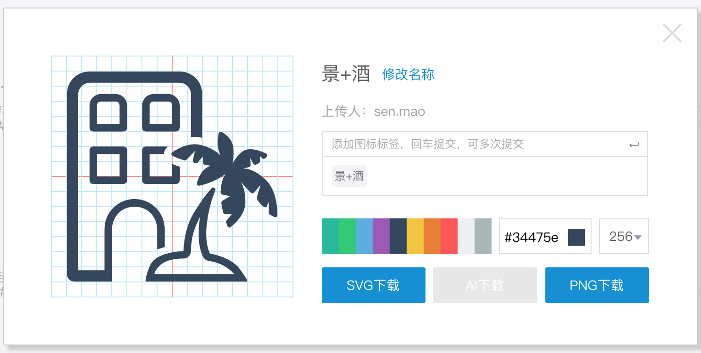
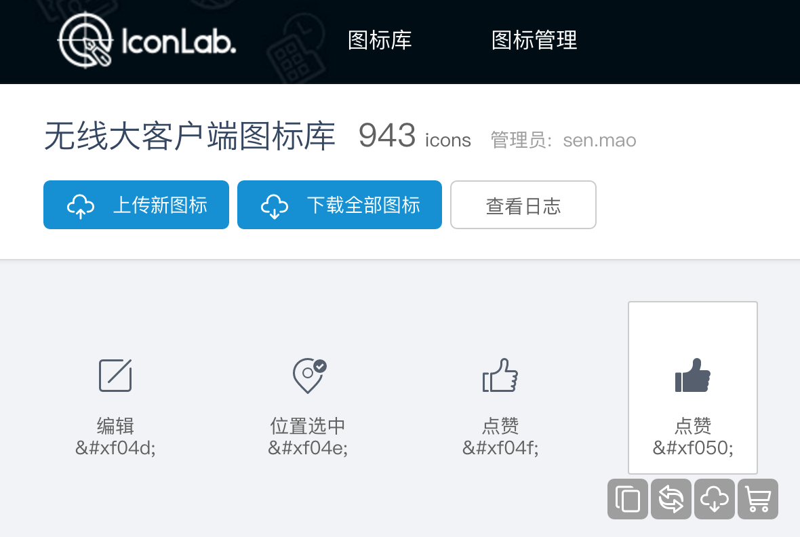
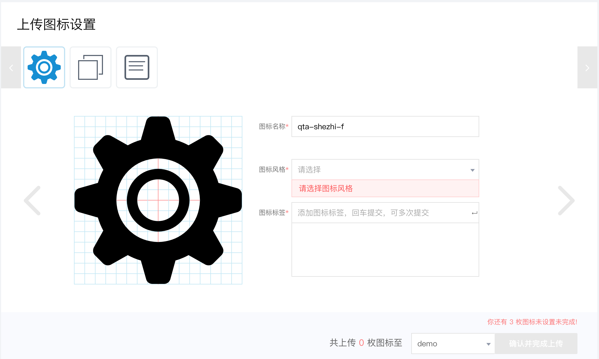

## 图标大库

图标大库包含首页图标大库展示，以及进入大库后字体上传和下载等功能。所有用户均可对图标进行图标贡献、对图标进行收藏和放入小车，并能够在界面中对图标进行名称、标签等图标基本信息的编辑。

顶部导航栏有搜索框，用户还可以通过输入图标名称、标签等基本信息来对图标进行搜索。

### 图标下载

设计者在进行设计稿绘制的时候可以下载库中的图标字体，在 PS 中引入字体文件，进行设计图绘制；开发者也可以下载整库图标进行开发使用。

### 收集图标与创建项目

开发者可以挑选喜欢的图标，只要点击图标下方的小车就可以快速的将图标添加到购物车，之后便可以在图标中创建项目（保存为新项目或保存到已有项目中）。

在使用时可以方面的在界面查看图标的 unicode 码值，点击复制字体，可以直接将字体复制到剪切板中（**注意，不是编码哦**）。

### 大库管理

每个大库有以为管理员，可以对库图标进行替换。图标替换不会对图标码值进行修改，但是可以修改名称、标签等。因此这里对已上线图标的替换要进行严格的把关，必须保证图标含义不变，仅为微量调整。

## 上传与审核

上传审核时新图标进入大库的流程，是将 svg 转化为 iconfont 的一个过程。我们采用指定管理员审核上传图标的方式，在图标入库之前进行一次把关，以此来确保图标在生成字体时不会出现异常状况，以及图标样式的统一。

### 图标上传

设计者可以根据需求绘制 SVG 图标，并将图标上传至对应的大库。点击右上角的上传按钮，进入上传界面；上传图标之后可以对图标进行批量设置，之后点击确认便可完成本次上传。

在上传过程中，我们会对 SVG 图标进行体积压缩和优化，如果看到上传的图标与设计的效果不一致，请放弃本次上传，仔细检查图标是否符合设计规范。

### 图标审核

大库管理员或超管均有权限对图标进行审核，在审核界面管理员可以标记某图标是否审核通过，还可以修改图标名称和图标风格。在审核完成之后，点击提交审核，通过审核的图标就会进入到对应的图标大库中。

## 项目管理

项目管理是链接图标制作和使用的桥梁，设计者制作的图标通过这一过程被开发者筛选整理，最终生成一份可用字体。在整个项目管理的过程中，一般是设计者或前端开发的负责人创建一个对应的项目，然后添加项目成员，让大家均可维护该项目。当项目图标添加完成之后，就可以生成一份字体，发布到线上供项目使用。

### 项目管理员编辑

项目管理员在通过小车创建项目之后，可以对项目的基本信息进行编辑、添加项目成员、删除项目以及进行项目的图标管理。

注意到项目的最右侧有调整基线的选项，这里是由于之前我们的图标基线偏高；如果在实际使用过程中，有英文、中文字体与图标无法对齐的情况，请管理员勾选调整基线进行调整。

### 项目使用

项目参与者可以使用项目，包括通过小车添加新图标、删除项目图标、下载字体进行使用等。但是项目参与者也不要偷偷乱改项目，因为我们对项目有版本记录的功能，每次的操作都会导致项目版本变动并记录日志，管理员可以轻松的查到哦。
